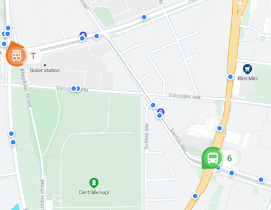
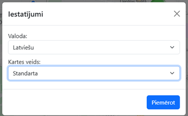
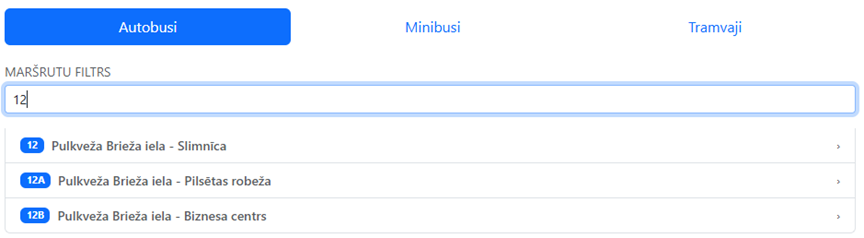
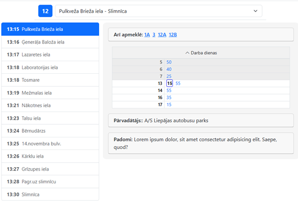
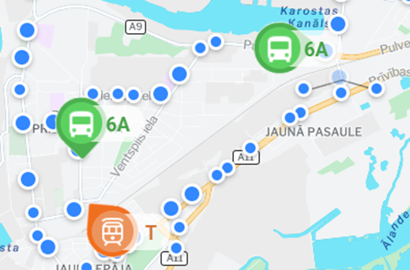
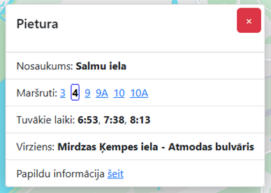
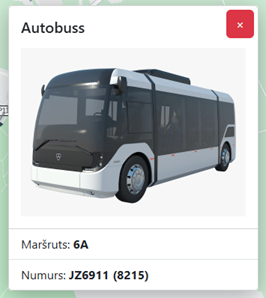
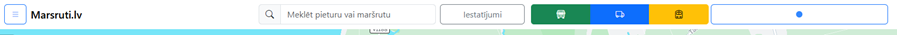
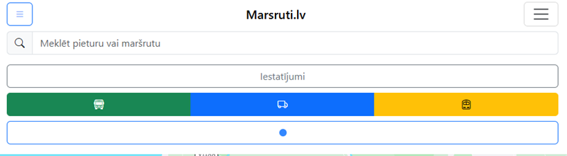

## Website for navigating and viewing public transport in real time
---
### Project advantages:
1. __Customized icon system__ - new vehicle icons (each vehicle type has its own icon) and stop icons were created and personally drawn for the project.

2. __Buttons to display a specific vehicle__ - To make it easier to use and to view only those vehicles that are currently needed, the site has buttons that can be used to display only a specific vehicle. 

3. __Personalization options__ - To personalize the site, there is a settings button (settings are stored in cookie files) where you can change the site language (Russian or Latvian) and change the map (for those who prefer a different site style). 

4. __Route search and site status field__ - To view the schedule, open the curtain on the left side of the website. If you scroll down, there is a field for website activity, which is necessary to identify request errors, because if the website "marsruti.lv" does not respond, it will be noted in this project, and you can also find information about the number of such transports in that place.

5. __Curtain with list and adaptive tables__ - To view the routes, a convenient curtain system with a modern design and adaptive tables was created, where, by clicking on each time, the next transport arrival time will be displayed at other stops. Similarly, all tables can be hidden, or one of them can be compressed depending on the day of the week. In addition, the time that has already passed is _colored gray_.

6. __Site interactivity__ - When the user interacts with the site, to ensure better visibility, when the map zooms out from places where stops are too close to each other, these stops are grouped into a cluster and, as a result, a larger icon appears on the map. 

7. __Windows with stop and transport descriptions__ - When you select any stop or vehicle, a window opens on the website with detailed information about that object.
For example, for the stop:
_Stop name, Routes passing through this stop, Closest arrival times, Direction of the selected route, Hyperlink to a window with the full schedule and route movements_.

8. __Optimization for mobile devices__ - To ensure convenient operation on screens of any size, the site is optimized for mobile devices. When the screen is reduced, the graphics take up the entire screen, and the transport display buttons are hidden in a special list. However, the _map can still be viewed_. 

